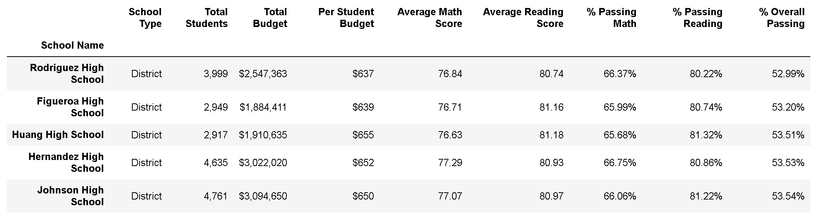

# PyCitySchools Analysis

* In the aggregate of the data to there are certain observable trends in school performance:
  * Generally, Charter schools have much higher passing rates (math, reading, overall) with having a lower per student budget as compared to the District schools.
   * Top 5 performers are Charter schools, while the bottom 5 are District schools.
  * The more dollars spent per pupil does not equate to better passing scores.
  * Average math and reading scores stay consistent across all schools.

 
### District Summary

### School Summary

### Top Performing Schools (By % Overall Passing)

### Bottom Performing Schools (By % Overall Passing)

### Math Scores by Grade

### Reading Scores by Grade

### Scores by School Spending

  
### Scores by School Size

### Scores by School Type

